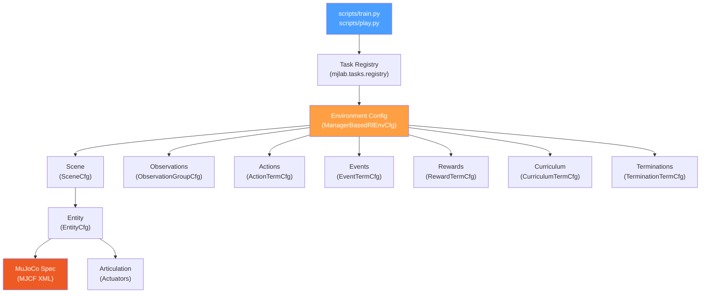
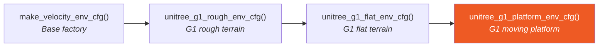
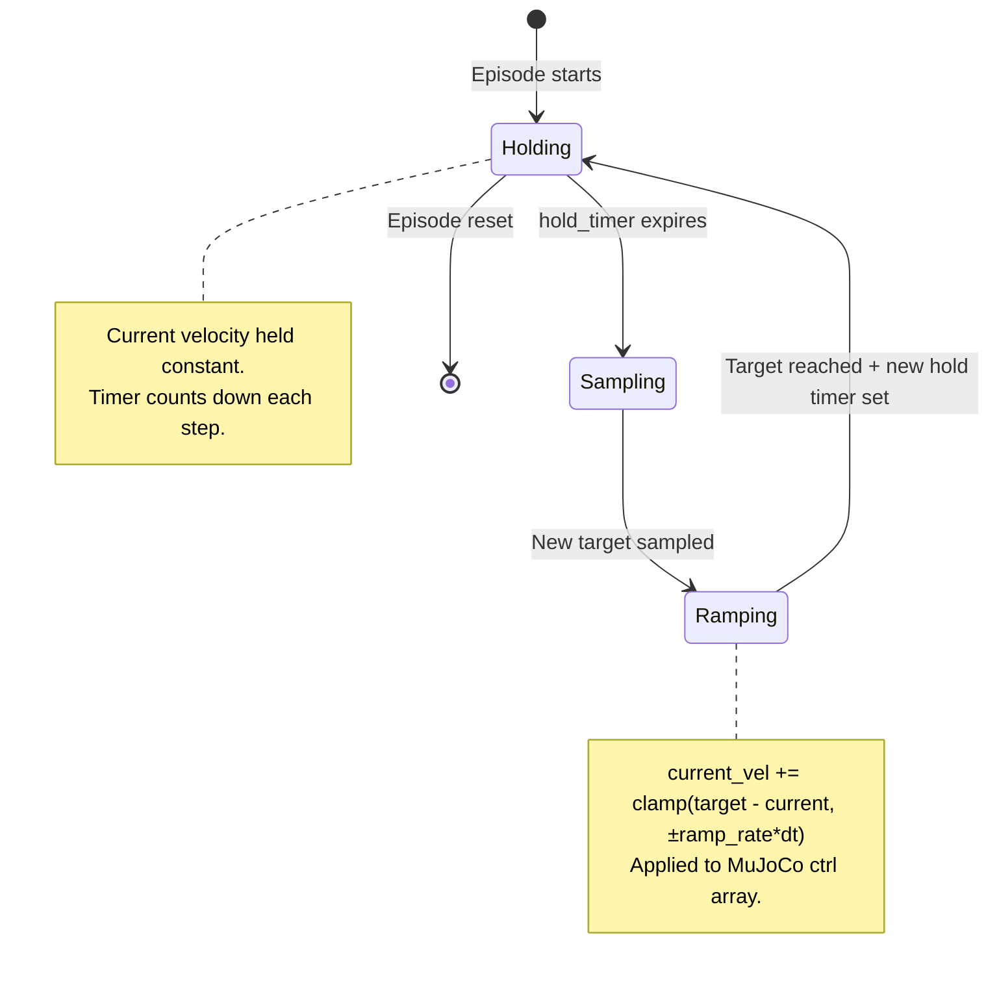
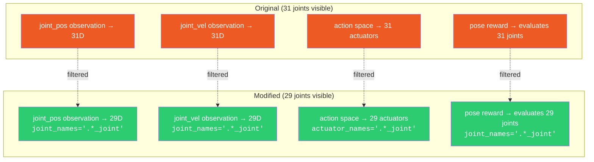
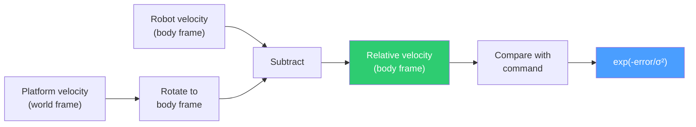
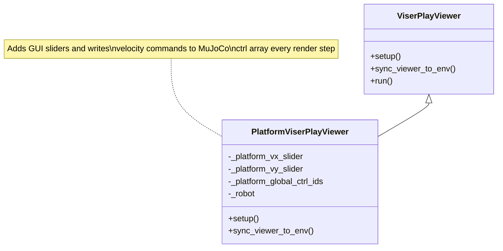
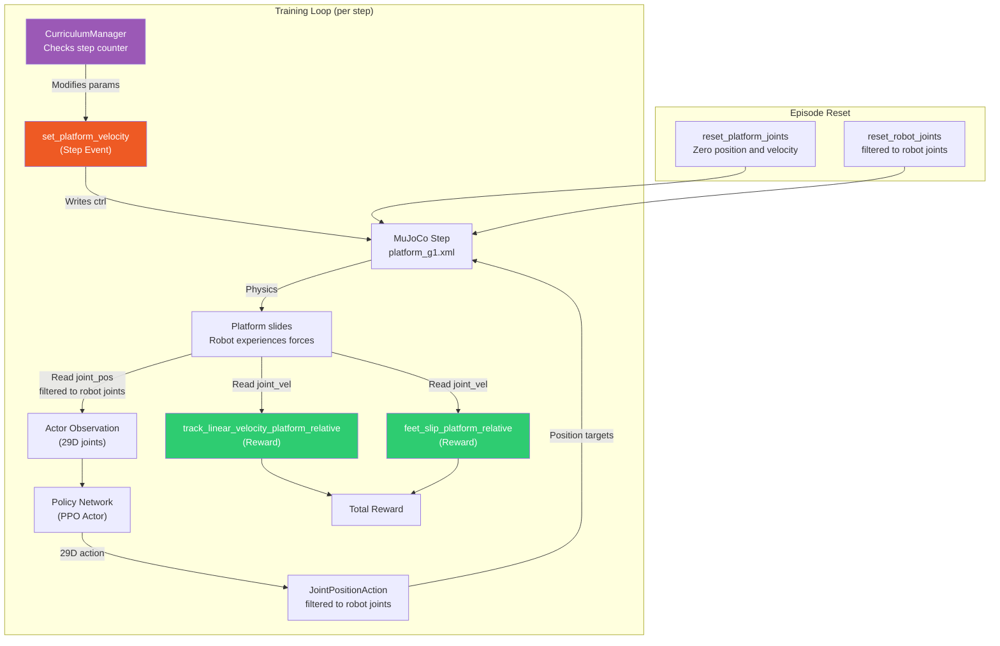

# Technical Analysis: Humanoid Locomotion on a Moving Platform

## Extension of the Unitree G1 RL Training Pipeline in MuJoCo

---

## 1. Introduction and Problem Statement

The original [unitree_rl_mjlab](file:///C:/Users/admin/Desktop/rl-humanoid/unitree_rl_mjlab) repository provides an end-to-end pipeline for training the Unitree G1 humanoid robot to perform velocity-tracking locomotion using Proximal Policy Optimization (PPO) in the MuJoCo physics simulator. The original system assumes that the robot operates on a **stationary ground surface** — either a flat plane (`Unitree-G1-Flat`) or procedurally-generated rough terrain (`Unitree-G1-Rough`).

The objective of this work was to extend the repository to support **humanoid balance and locomotion on a moving platform**, simulating a robot operating inside a moving vehicle (e.g., a bus, train, or ship). This required coordinated modifications across six layers of the software architecture:

1. **Physics layer** — a new MuJoCo model with actuated slide joints.
2. **Asset layer** — Python configuration to load the new model spec.
3. **Observation/action isolation** — preventing the policy from observing or actuating platform joints.
4. **Reward layer** — platform-relative velocity tracking and foot slip penalties.
5. **Curriculum layer** — progressive difficulty scheduling for platform velocity.
6. **Viewer layer** — interactive manual platform control during inference.

> [!IMPORTANT]
> All modifications described in this report correspond to commits **after** `1425b15` on the `main` branch (commits `a1cca58`, `54c5e8c`, `147059e`, and merge commit `5d23442`).

---

## 2. Repository Architecture Overview

### 2.1 High-Level Module Organization



### 2.2 Configuration Inheritance Chain

The G1 velocity task configurations follow an inheritance chain. This is critical for understanding the platform environment:



The platform config function calls `unitree_g1_flat_env_cfg()` and then applies targeted overrides. This design pattern means that:
- The platform environment inherits all reward terms, observation groups, event handlers, and termination conditions from the flat environment.
- It then **selectively replaces** only those components that are affected by the presence of a moving platform.

### 2.3 Markov Decision Process (MDP) Structure

The original MDP for the velocity-tracking task has these components:

| MDP Component  | Description | Key Functions |
|:---|:---|:---|
| **State** | Joint positions/velocities, IMU data, projected gravity, command | `joint_pos_rel`, `joint_vel_rel`, `projected_gravity` |
| **Action** | Target joint positions (29 DoF) | `JointPositionActionCfg` |
| **Reward** | Velocity tracking, posture, foot gait, slip penalty, etc. | `track_linear_velocity`, `feet_slip`, etc. |
| **Events** | Reset, push disturbance, domain randomization | `reset_root_state_uniform`, `push_by_setting_velocity` |
| **Curriculum** | Progressive velocity range, terrain difficulty | `commands_vel`, `terrain_levels_vel` |

---

## 3. Feature 1: Physics-Layer Platform Construction

### 3.1 Design Decision

The fundamental physics challenge was: *how to represent a surface that can translate in XY while supporting a humanoid?*

The chosen approach uses **two prismatic (slide) joints** attached to a large flat box geom, placed within the same kinematic tree as the robot. This is enabled by a new MJCF model that `<include>`s the original G1 robot definition and adds the platform body to `<worldbody>`.

### 3.2 New File: [platform_g1.xml](file:///C:/Users/admin/Desktop/rl-humanoid/unitree_rl_mjlab/src/assets/robots/unitree_g1/xmls/platform_g1.xml)

```xml
<mujoco model="platform_g1">
  <compiler angle="radian" meshdir="assets"/>
  <include file="g1.xml"/>

  <asset>
    <texture type="2d" name="groundplane" builtin="checker" .../>
    <material name="groundplane" texture="groundplane" .../>
  </asset>

  <worldbody>
    <body name="platform" pos="0 0 -0.01">
      <joint name="platform_x" type="slide" axis="1 0 0" limited="false" damping="50"/>
      <joint name="platform_y" type="slide" axis="0 1 0" limited="false" damping="50"/>
      <geom name="platform" type="box" size="10 10 0.01" material="groundplane"/>
    </body>
  </worldbody>

  <actuator>
    <velocity name="platform_x_vel" joint="platform_x" kv="100000"/>
    <velocity name="platform_y_vel" joint="platform_y" kv="100000"/>
  </actuator>
</mujoco>
```

**What changed:**
- A new `<body name="platform">` with two unlimited slide joints (`platform_x`, `platform_y`) is placed at `z = −0.01 m` (just below the robot's feet).
- Two `<velocity>` actuators drive the joints with gain `kv = 100000`, meaning commanded velocity targets are tracked with high fidelity by the physics engine.
- The platform geom is a 20 m × 20 m × 0.02 m box — large enough that the robot cannot walk off it during training.

**What problem it solves:**
- Creates a translating ground surface that can be driven programmatically during training, simulating inertial disturbances from a moving vehicle.
- Using `<include file="g1.xml"/>` avoids duplicating the entire robot model. The resulting compiled MjModel contains both the robot's 29 revolute joints and the platform's 2 slide joints — a total of 31 joints.

**How execution changes:**
- When the platform spec is loaded, MuJoCo compiles a kinematic tree with 31 joints and 31 actuators (29 position actuators for the robot + 2 velocity actuators for the platform).
- Contact detection now occurs between foot geoms and the platform geom rather than the static terrain plane.

**Hidden side effects:**
- The 2 additional slide joints (`platform_x`, `platform_y`) appear in `joint_pos`, `joint_vel`, and `ctrl` arrays of the MjData structure. Without careful filtering, the RL policy would observe and attempt to control these joints — a critical issue addressed in Feature 3.

### 3.3 Python Configuration: [g1_constants.py](file:///C:/Users/admin/Desktop/rl-humanoid/unitree_rl_mjlab/src/assets/robots/unitree_g1/g1_constants.py)

Three additions wire the new XML into the Python asset layer:

**3.3.1 Path constant** (Line 26–29):
```python
PLATFORM_G1_XML: Path = (
  SRC_PATH / "assets" / "robots" / "unitree_g1" / "xmls" / "platform_g1.xml"
)
assert PLATFORM_G1_XML.exists()
```

**3.3.2 Spec factory** (Lines 44–47):
```python
def get_platform_spec() -> mujoco.MjSpec:
  spec = mujoco.MjSpec.from_file(str(PLATFORM_G1_XML))
  spec.assets = get_assets(spec.meshdir)
  return spec
```
Reuses the same mesh assets as the standard G1 (since `platform_g1.xml` includes `g1.xml`).

**3.3.3 Entity configuration** (Lines 298–305):
```python
def get_g1_platform_robot_cfg() -> EntityCfg:
  return EntityCfg(
    init_state=HOME_KEYFRAME,
    collisions=(FULL_COLLISION,),
    spec_fn=get_platform_spec,     # ← Points to platform spec
    articulation=G1_ARTICULATION,  # ← Same actuator definitions
  )
```

**What problem it solves:** Provides a clean configuration entry point that the environment config can call to get a fully configured platform+robot entity. The same `HOME_KEYFRAME` and `G1_ARTICULATION` are reused, ensuring the robot initializes identically.

**3.3.4 Export** via [src/assets/robots/\_\_init\_\_.py](file:///C:/Users/admin/Desktop/rl-humanoid/unitree_rl_mjlab/src/assets/robots/__init__.py) (Line 18):
```python
get_g1_platform_robot_cfg as get_g1_platform_robot_cfg,
```

---

## 4. Feature 2: Moving Platform Dynamics (Step Event)

### 4.1 Design Decision

The platform must move with **realistic, vehicle-like motion**: smooth accelerations, random direction changes, and sustained velocity holds. A simple random velocity at each step would produce unrealistic jitter. The solution is a **stateful step event** that implements a velocity ramping controller.

### 4.2 Implementation: [set_platform_velocity](file:///C:/Users/admin/Desktop/rl-humanoid/unitree_rl_mjlab/src/tasks/velocity/mdp/platform_events.py#L51-L154)

This is a class-based event term (callable with `__init__`, `__call__`, and `reset` methods) that runs every simulation step (`mode="step"`).



**Lifecycle per environment (per step):**

1. **Decrement hold timers** — `self._hold_timer -= dt`
2. **Resample expired targets** — For any environment whose timer ≤ 0:
   - Sample new target velocities from `velocity_range` (e.g., X ∈ [−0.3, 0.3], Y ∈ [−0.3, 0.3])
   - Sample new hold duration from `hold_time_s` (e.g., 2–5 seconds)
3. **Ramp toward target** — Compute `step = clamp(target − current, ±ramp_rate × dt)` and update `current_vel += step`
4. **Apply to MuJoCo** — Write `current_vel` directly to `data.ctrl[:, platform_ctrl_ids]`

**What problem it solves:**
- `ramp_rate` controls how sharp velocity transitions are. Low values (0.5 m/s²) produce gentle acceleration; high values (20 m/s²) produce near-instantaneous jumps. This parameter is later modulated by the curriculum.
- `hold_time_s` ensures the platform holds a constant velocity long enough for the robot to adapt its posture.

**How execution changes:**
- Every simulation step, the platform velocity is smoothly interpolated toward a random target. The robot experiences inertial forces due to the platform's acceleration.
- The MuJoCo velocity actuator (kv = 100000) ensures the actual joint velocity closely tracks the commanded value.

**Hidden side effects:**
- The `__init__` method resolves actuator IDs using `find_actuators(("platform_x_vel", "platform_y_vel"))`, then maps them to global ctrl indices via `data.indexing.ctrl_ids`. This is necessary because the compiled MjModel may reorder actuators.
- The `reset()` method explicitly zeros both `data.ctrl` and `joint_vel_target` for the platform joints. Without this, residual velocities from a previous episode could carry over.

### 4.3 Reset Event: Platform Joint Zeroing

In [env_cfgs.py](file:///C:/Users/admin/Desktop/rl-humanoid/unitree_rl_mjlab/src/tasks/velocity/config/g1/env_cfgs.py#L294-L302):
```python
cfg.events["reset_platform_joints"] = EventTermCfg(
  func=src_mdp.reset_joints_by_offset,
  mode="reset",
  params={
    "position_range": (0.0, 0.0),
    "velocity_range": (0.0, 0.0),
    "asset_cfg": SceneEntityCfg("robot", joint_names=("platform_x", "platform_y")),
  },
)
```

**What problem it solves:** At episode reset, the platform's position and velocity are zeroed. This prevents the platform from drifting arbitrarily far from the origin over many episodes, which would cause numerical issues.

---

## 5. Feature 3: Observation and Action Space Isolation

### 5.1 The Core Problem

When `platform_g1.xml` is compiled, the resulting MjModel has **31 joints** (29 robot + 2 platform) and **31 actuators** (29 position + 2 velocity). Without intervention:
- The observation function `joint_pos_rel` would return a 31-dimensional vector, including platform slide positions.
- The action space would attempt to send 31-dimensional position targets, including to the platform's velocity actuators.
- Reward functions like `pose`, `stand_still`, `joint_pos_limits`, and `joint_acc_l2` would erroneously evaluate platform joints.

The policy must **not** observe, actuate, or be rewarded for platform joint states. This required systematic filtering across four subsystems.

### 5.2 Changes in [env_cfgs.py](file:///C:/Users/admin/Desktop/rl-humanoid/unitree_rl_mjlab/src/tasks/velocity/config/g1/env_cfgs.py)



The regex pattern `.*_joint` matches all 29 robot joints (which end in `_joint`, e.g., `left_hip_pitch_joint`) but excludes the platform slide joints (`platform_x` and `platform_y`, which do **not** end in `_joint`).

**5.2.1 Observation filtering** (Lines 239–256):
```python
for group_name in ["actor", "critic"]:
    group = cfg.observations[group_name]
    if "joint_pos" in group.terms:
      term = group.terms["joint_pos"]
      group.terms["joint_pos"] = ObservationTermCfg(
        func=term.func, noise=term.noise,
        params={"asset_cfg": SceneEntityCfg("robot", joint_names=(".*_joint",))}
      )
    # Same for "joint_vel"
```

**5.2.2 Action space filtering** (Lines 273–275):
```python
joint_pos_action = cfg.actions["joint_pos"]
assert isinstance(joint_pos_action, JointPositionActionCfg)
joint_pos_action.actuator_names = (".*_joint",)
```

**5.2.3 Event filtering** (Line 260):
```python
cfg.events["reset_robot_joints"].params["asset_cfg"].joint_names = (".*_joint",)
```
Without this, the reset event would randomize the platform joint positions.

**5.2.4 Reward filtering** (Lines 263–270):
```python
cfg.rewards["pose"].params["asset_cfg"].joint_names = ".*_joint"
cfg.rewards["stand_still"].params["asset_cfg"].joint_names = ".*_joint"
cfg.rewards["joint_pos_limits"].params["asset_cfg"] = SceneEntityCfg("robot", joint_names=".*_joint")
cfg.rewards["joint_acc_l2"].params["asset_cfg"] = SceneEntityCfg("robot", joint_names=".*_joint")
```

**What problem this solves:**
- Ensures the RL policy operates on exactly the same 29-dimensional observation/action space as the original flat environment.
- Prevents the gradient signal from being corrupted by platform joint states that the policy cannot control.
- Maintains compatibility with trained flat-environment checkpoints for potential fine-tuning.

**Hidden side effects:**
- The regex `.*_joint` is safe because the naming convention is strictly followed in the MJCF: all robot joints end with `_joint`, and the platform joints are named `platform_x` / `platform_y` without that suffix.

### 5.3 Contact Sensor Update

The original `feet_ground_contact` sensor detects contact between foot geoms and the body named `terrain`. With the platform replacing the terrain, this pattern must change:

```python
for sensor in cfg.scene.sensors or ():
    if sensor.name == "feet_ground_contact":
      sensor.secondary.pattern = "robot/platform"
```

**What problem it solves:** The platform is part of the robot's kinematic tree (since `platform_g1.xml` includes `g1.xml`), so its geom is namespaced under the entity name `robot`. The contact sensor must reference `robot/platform` to correctly detect foot-platform contacts.

### 5.4 Terrain Disabling

```python
cfg.scene.terrain = None
```

**What problem it solves:** The flat environment config includes a terrain plane. With the platform providing the walking surface, the default terrain would create a redundant, overlapping ground plane. Setting it to `None` removes it entirely.

### 5.5 Collision Configuration

```python
platform_collision = CollisionCfg(
    geom_names_expr=(".*_collision", "platform"),
    condim={r"^(left|right)_foot[1-7]_collision$": 3, ".*_collision": 1, "platform": 3},
    priority={r"^(left|right)_foot[1-7]_collision$": 1, "platform": 1},
    friction={r"^(left|right)_foot[1-7]_collision$": (0.6,), "platform": (0.6,)},
)
robot_cfg.collisions = (platform_collision,)
```

**What changed:** The original `FULL_COLLISION` config only references `.*_collision` geoms (robot body parts). The new config adds the `platform` geom to the collision expression, with:
- `condim=3` for both foot and platform geoms (full frictional contact)
- Matching `priority=1` and `friction=0.6` for foot–platform pairs

**What problem it solves:** Without explicitly including the platform geom in the collision configuration, MuJoCo would not generate contact forces between the robot's feet and the platform surface, causing the robot to fall through.

---

## 6. Feature 4: Platform-Relative Reward Functions

### 6.1 The Frame-of-Reference Problem

On a stationary ground, the robot's body-frame velocity equals its velocity relative to the walking surface. On a moving platform, this is no longer true:

$$v_{\text{robot,world}} = v_{\text{robot,platform}} + v_{\text{platform,world}}$$

If the policy is rewarded for tracking a commanded velocity in the world frame, it would learn to stand still while the platform carries it — which is physically correct but fails to train useful balancing behavior.

### 6.2 Platform-Relative Velocity Tracking: [track_linear_velocity_platform_relative](file:///C:/Users/admin/Desktop/rl-humanoid/unitree_rl_mjlab/src/tasks/velocity/mdp/platform_events.py#L160-L211)



**Implementation detail:**
```python
# Platform velocity from slide joint velocities (world frame)
platform_vel_w = torch.zeros(env.num_envs, 3, device=env.device)
platform_vel_w[:, 0] = asset.data.joint_vel[:, self._platform_joint_ids[0]]
platform_vel_w[:, 1] = asset.data.joint_vel[:, self._platform_joint_ids[1]]

# Rotate into robot body frame
platform_vel_b = quat_apply_inverse(asset.data.root_link_quat_w, platform_vel_w)

# Relative velocity
relative_vel_b = robot_vel_b - platform_vel_b

# Tracking error
xy_error = torch.sum(torch.square(command[:, :2] - relative_vel_b[:, :2]), dim=1)
z_error = torch.square(relative_vel_b[:, 2])
lin_vel_error = xy_error + (2 * z_error)
return torch.exp(-lin_vel_error / std**2)
```

**Comparison with original [track_linear_velocity](file:///C:/Users/admin/Desktop/rl-humanoid/unitree_rl_mjlab/src/tasks/velocity/mdp/rewards.py#L23-L40):**

| Aspect | Original | Platform-Relative |
|:---|:---|:---|
| Reference frame | World / body frame | Body frame, relative to platform |
| Platform velocity | Not considered | Subtracted from robot velocity |
| Rotation | Not needed (ground is stationary) | `quat_apply_inverse` to convert platform velocity from world to body frame |
| Z velocity | Penalized (2× weight) | Same penalty applied to relative Z velocity |
| Math structure | Identical Gaussian kernel | Identical Gaussian kernel after subtraction |

**What problem it solves:** Ensures the velocity command is interpreted as "walk at X m/s *relative to the platform surface*," which is the physically meaningful interpretation for a passenger on a moving vehicle.

**Hidden side effect:** The function reads `asset.data.joint_vel[:, platform_joint_ids]` — the raw slide joint velocities. These are in **world frame** by construction (since the slide joints are direct children of `<worldbody>`). The rotation via `quat_apply_inverse` is necessary because the velocity command is in the robot's **body frame**.

### 6.3 Platform-Relative Foot Slip Penalty: [feet_slip_platform_relative](file:///C:/Users/admin/Desktop/rl-humanoid/unitree_rl_mjlab/src/tasks/velocity/mdp/platform_events.py#L218-L280)

**Comparison with original [feet_slip](file:///C:/Users/admin/Desktop/rl-humanoid/unitree_rl_mjlab/src/tasks/velocity/mdp/rewards.py#L267-L294):**

| Aspect | Original | Platform-Relative |
|:---|:---|:---|
| Foot velocity | `site_lin_vel_w[:, :, :2]` (world frame XY) | `site_lin_vel_w[:, :, :2] - platform_vel_xy` |
| "No slip" condition | Foot stationary in world frame | Foot moving at platform velocity |
| Contact check | Same | Same |
| Metric logging | Same | Same |

```python
# Platform world-frame velocity, broadcast over feet
platform_vel_xy = torch.stack([
  asset.data.joint_vel[:, self._platform_joint_ids[0]],
  asset.data.joint_vel[:, self._platform_joint_ids[1]],
], dim=-1).unsqueeze(1)  # [B, 1, 2]

# Foot velocity relative to platform
relative_foot_vel_xy = foot_vel_xy - platform_vel_xy  # [B, N, 2]
```

**What problem it solves:** On a moving platform, a foot that is correctly planted moves at the platform's velocity in the world frame. The original `feet_slip` would penalize this motion. The relative version correctly penalizes only **sliding relative to the platform surface**.

### 6.4 Action Rate Penalty Adjustment

```python
if "action_rate_l2" in cfg.rewards:
    cfg.rewards["action_rate_l2"].weight = -0.03  # Was -0.05
```

**What problem it solves:** On a moving platform, the robot needs to make more frequent corrective actions to maintain balance. A high action rate penalty would suppress these corrections, making the policy overly rigid. Reducing the weight from −0.05 to −0.03 gives the policy more freedom to react to platform perturbations while still discouraging unnecessarily jerky motions.

### 6.5 Reward Replacement in Configuration

In [env_cfgs.py](file:///C:/Users/admin/Desktop/rl-humanoid/unitree_rl_mjlab/src/tasks/velocity/config/g1/env_cfgs.py#L308-L327):
```python
# Replace velocity tracking
cfg.rewards["track_linear_velocity"] = RewardTermCfg(
    func=src_mdp.track_linear_velocity_platform_relative,
    weight=1.0,
    params={"command_name": "twist", "std": math.sqrt(0.25)},
)

# Replace foot slip
cfg.rewards["foot_slip"] = RewardTermCfg(
    func=src_mdp.feet_slip_platform_relative,
    weight=-0.25,
    params={...},
)
```

**What problem it solves:** By assigning to existing dictionary keys (`"track_linear_velocity"` and `"foot_slip"`), the platform-relative versions **replace** the original reward terms in-place. This ensures that:
- All other inherited rewards (posture, gait, clearance, angular momentum, etc.) remain unchanged.
- The total reward structure is maintained — only the frame-of-reference for velocity-dependent terms changes.

---

## 7. Feature 5: Curriculum Learning for Platform Velocity

### 7.1 Design Decision

Exposing the robot to high-speed, sharply-changing platform motion from the start of training would make the task too difficult. The solution is a **three-stage curriculum** that progressively increases both the velocity range and the ramp sharpness.

### 7.2 Implementation: [platform_velocity_curriculum](file:///C:/Users/admin/Desktop/rl-humanoid/unitree_rl_mjlab/src/tasks/velocity/mdp/platform_events.py#L294-L315)

```python
def platform_velocity_curriculum(
  env: ManagerBasedRlEnv,
  env_ids: torch.Tensor,
  event_name: str,
  velocity_stages: list[PlatformVelocityStage],
) -> dict[str, torch.Tensor]:
  del env_ids  # Unused.
  term_cfg = env.event_manager.get_term_cfg(event_name)
  for stage in velocity_stages:
    if env.common_step_counter > stage["step"]:
      term_cfg.params["velocity_range"] = {"x": stage["x"], "y": stage["y"]}
      term_cfg.params["ramp_rate"] = stage["ramp_rate"]
  return {}
```

**How it works:** The curriculum function is called by the `CurriculumManager` at each training iteration. It reads the `common_step_counter` and modifies the `set_platform_velocity` event's parameters **in-place**. This directly changes the behavior of the step event on the next call.

### 7.3 Stage Configuration

Configured in [env_cfgs.py](file:///C:/Users/admin/Desktop/rl-humanoid/unitree_rl_mjlab/src/tasks/velocity/config/g1/env_cfgs.py#L336-L355):

```mermaid
gantt
    title Platform Velocity Curriculum
    dateFormat X
    axisFormat %s steps

    section Velocity Range
    ±0.3 m/s (initial)      :a1, 0, 240000
    ±0.8 m/s (Stage 0)      :a2, 240000, 252000
    ±1.4 m/s (Stage 1)      :a3, 252000, 288000
    ±2.0 m/s (Stage 2)      :a4, 288000, 350000

    section Ramp Rate
    0.5 m/s² (initial)      :b1, 0, 240000
    5.0 m/s² (Stage 0)      :b2, 240000, 252000
    10.0 m/s² (Stage 1)     :b3, 252000, 288000
    20.0 m/s² (Stage 2)     :b4, 288000, 350000
```



| Stage | Step Threshold | Velocity Range (X, Y) | Ramp Rate | Training Phase |
|:---:|:---|:---|:---|:---|
| Initial | 0 | ±0.3 m/s | 0.5 m/s² | Robot learns basic balance with gentle motion |
| 0 | 10,000 × 24 = 240,000 | ±0.8 m/s | 5.0 m/s² | Moderate speed, faster transitions |
| 1 | 10,500 × 24 = 252,000 | ±1.4 m/s | 10.0 m/s² | Higher speed, sharper acceleration |
| 2 | 12,000 × 24 = 288,000 | ±2.0 m/s | 20.0 m/s² | Full speed, near-instantaneous direction changes |

**What problem it solves:** The curriculum ensures stable policy convergence by gradually increasing task difficulty:
- **Early training**: The robot learns to walk on a nearly-stationary platform (same as flat ground).
- **Mid training**: The robot adapts to moderate perturbations.
- **Late training**: The robot handles aggressive, vehicle-like motion profiles.

**How execution changes:** The curriculum function modifies `term_cfg.params` of the `set_platform_velocity` event. Since the step event reads these params on every call, the changes take effect immediately — no environment reconstruction is needed.

**Interaction with existing velocity curriculum:** The original `command_vel` curriculum (which widens the velocity command range) remains active. Both curricula operate independently: the robot simultaneously learns to track wider velocity commands while balancing on increasingly aggressive platform motion.

### 7.4 Comparison with Original Curriculum Pattern

The platform curriculum follows the same architectural pattern as the existing `commands_vel` curriculum in [curriculums.py](file:///C:/Users/admin/Desktop/rl-humanoid/unitree_rl_mjlab/src/tasks/velocity/mdp/curriculums.py#L67-L92):

| Aspect | `commands_vel` | `platform_velocity_curriculum` |
|:---|:---|:---|
| Modifies | Command term config ranges | Event term config params |
| Stage type | `VelocityStage` (TypedDict) | `PlatformVelocityStage` (TypedDict) |
| Trigger | `common_step_counter` | `common_step_counter` |
| Step multiplier | × 24 (decimation) | × 24 (decimation) |
| Pattern | Iterate stages, apply if step > threshold | Identical |

---

## 8. Feature 6: Interactive Platform Control (Play-Time Viewer)

### 8.1 Design Decision

During inference ("play" mode), the random platform velocity events are disabled (see Section 9). To still evaluate the trained policy under platform motion, a **manual control interface** was added to the Viser web viewer.

### 8.2 Implementation: [PlatformViserPlayViewer](file:///C:/Users/admin/Desktop/rl-humanoid/unitree_rl_mjlab/scripts/play.py#L42-L101)



**What changed:**
- A new class `PlatformViserPlayViewer` extends the framework's `ViserPlayViewer`.
- `setup()` adds a "Platform Control" GUI folder with two sliders (X/Y velocity, ±2.0 m/s, 0.05 step) and a "Zero Platform Speed" button.
- `sync_viewer_to_env()` writes the slider values directly to `data.ctrl[:, platform_ctrl_ids]` every simulation step.
- In the `run_play` function (line 235), `ViserPlayViewer` is replaced with `PlatformViserPlayViewer`.

**What problem it solves:** Allows the operator to manually test the trained policy's robustness by sliding the platform at any speed and direction in real time. This is essential for qualitative evaluation and demonstration.

**How execution changes:** The viewer setup attempts to find platform actuators. If they don't exist (e.g., when running a `Unitree-G1-Flat` task), the `try/except` block gracefully skips the GUI setup, making the viewer backward-compatible with all task types.

**Hidden side effect:** The `PlatformViserPlayViewer` is now used for **all** tasks (not just platform tasks), since `play.py` unconditionally instantiates it. However, the `try/except` in `setup()` ensures it degrades gracefully — non-platform tasks simply don't get the slider UI.

---

## 9. Feature 7: Task Registration and Play-Mode Overrides

### 9.1 Task Registration

In [src/tasks/velocity/config/g1/\_\_init\_\_.py](file:///C:/Users/admin/Desktop/rl-humanoid/unitree_rl_mjlab/src/tasks/velocity/config/g1/__init__.py#L27-L33):

```python
register_mjlab_task(
  task_id="Unitree-G1-Platform",
  env_cfg=unitree_g1_platform_env_cfg(),
  play_env_cfg=unitree_g1_platform_env_cfg(play=True),
  rl_cfg=unitree_g1_ppo_runner_cfg(),
  runner_cls=VelocityOnPolicyRunner,
)
```

**What problem it solves:** Registers the new task with the global task registry. This allows the training and play scripts to be invoked with:
```bash
python scripts/train.py Unitree-G1-Platform
python scripts/play.py Unitree-G1-Platform
```

### 9.2 Play-Mode Configuration

When `play=True`, the platform environment disables training-specific components:

```python
if play:
    cfg.events.pop("set_platform_velocity", None)
    cfg.curriculum.pop("platform_velocity", None)
```

**What problem it solves:** During inference, automatic platform velocity randomization would make demonstrations unpredictable. Removing the step event and curriculum allows the operator to use the `PlatformViserPlayViewer` sliders for **manual, deterministic** platform control.

### 9.3 Module Export

In [src/tasks/velocity/mdp/\_\_init\_\_.py](file:///C:/Users/admin/Desktop/rl-humanoid/unitree_rl_mjlab/src/tasks/velocity/mdp/__init__.py#L8):
```python
from .platform_events import *  # noqa: F403
```

**What problem it solves:** Exposes all symbols from `platform_events.py` (the event term, reward classes, and curriculum function) through the `src.tasks.velocity.mdp` namespace. This enables the environment config to reference them as `src_mdp.set_platform_velocity`, `src_mdp.track_linear_velocity_platform_relative`, etc.

---

## 10. End-to-End Data Flow



---

## 11. Summary of All Modifications by File

| File | Type | Change Summary |
|:---|:---:|:---|
| [platform_g1.xml](file:///C:/Users/admin/Desktop/rl-humanoid/unitree_rl_mjlab/src/assets/robots/unitree_g1/xmls/platform_g1.xml) | **NEW** | MuJoCo model: platform body with 2 slide joints + 2 velocity actuators |
| [g1_constants.py](file:///C:/Users/admin/Desktop/rl-humanoid/unitree_rl_mjlab/src/assets/robots/unitree_g1/g1_constants.py) | MODIFIED | +`PLATFORM_G1_XML`, +`get_platform_spec()`, +`get_g1_platform_robot_cfg()` |
| [robots/\_\_init\_\_.py](file:///C:/Users/admin/Desktop/rl-humanoid/unitree_rl_mjlab/src/assets/robots/__init__.py) | MODIFIED | +Export `get_g1_platform_robot_cfg` |
| [platform_events.py](file:///C:/Users/admin/Desktop/rl-humanoid/unitree_rl_mjlab/src/tasks/velocity/mdp/platform_events.py) | **NEW** | `set_platform_velocity`, `track_linear_velocity_platform_relative`, `feet_slip_platform_relative`, `platform_velocity_curriculum` |
| [mdp/\_\_init\_\_.py](file:///C:/Users/admin/Desktop/rl-humanoid/unitree_rl_mjlab/src/tasks/velocity/mdp/__init__.py) | MODIFIED | +`from .platform_events import *` |
| [env_cfgs.py](file:///C:/Users/admin/Desktop/rl-humanoid/unitree_rl_mjlab/src/tasks/velocity/config/g1/env_cfgs.py) | MODIFIED | +`unitree_g1_platform_env_cfg()` function (160 lines) |
| [config/g1/\_\_init\_\_.py](file:///C:/Users/admin/Desktop/rl-humanoid/unitree_rl_mjlab/src/tasks/velocity/config/g1/__init__.py) | MODIFIED | +Import `unitree_g1_platform_env_cfg`, +Register `Unitree-G1-Platform` task |
| [play.py](file:///C:/Users/admin/Desktop/rl-humanoid/unitree_rl_mjlab/scripts/play.py) | MODIFIED | +`PlatformViserPlayViewer` class (62 lines), replace viewer instantiation |

---

## 12. Design Principles and Engineering Decisions

### 12.1 Composition Over Duplication
The platform config calls `unitree_g1_flat_env_cfg()` and applies targeted overrides rather than copying the entire configuration. This ensures that bug fixes or tuning changes to the flat environment automatically propagate to the platform environment.

### 12.2 Regex-Based Joint Filtering
The naming convention (`*_joint` for robot, `platform_x`/`platform_y` for platform) enables a single regex `.*_joint` to cleanly separate the two. This is more maintainable than hardcoding joint indices.

### 12.3 Class-Based Event Terms
The `set_platform_velocity` event uses a class with persistent state (velocity tensors, timers) rather than a stateless function. This is necessary because the ramping controller needs to remember the current velocity between steps.

### 12.4 Graceful Degradation
The `PlatformViserPlayViewer` uses try/except to handle non-platform tasks, and the platform config uses dictionary `.pop()` with defaults to safely remove optional terms. This prevents crashes when configurations are missing.

### 12.5 Stationary Platform as a Special Case
The initial curriculum stage (ramp_rate = 0.5, velocity_range = ±0.3) effectively produces near-stationary platform behavior. This means Stage 2 of the development plan (walk on stationary platform) is a natural byproduct of the initial curriculum stage — no separate configuration was needed.

---

## 13. Conclusion

The modifications transform the original fixed-ground locomotion pipeline into a moving-platform balance training system through six coordinated engineering features. The design follows principles of minimal modification, compositional configuration, and physical correctness (frame-of-reference transformations). The curriculum learning strategy ensures stable policy convergence by progressively increasing platform disturbance intensity, while the interactive viewer enables qualitative evaluation of the trained policy's robustness to arbitrary platform motions.
